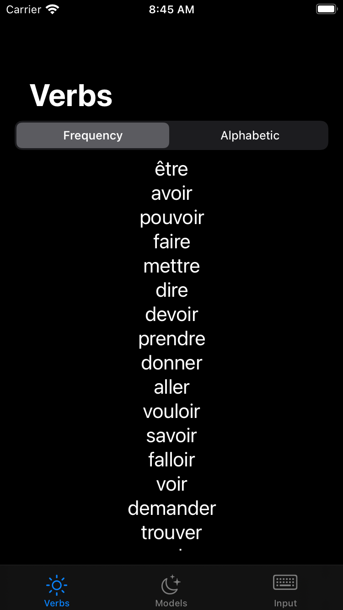
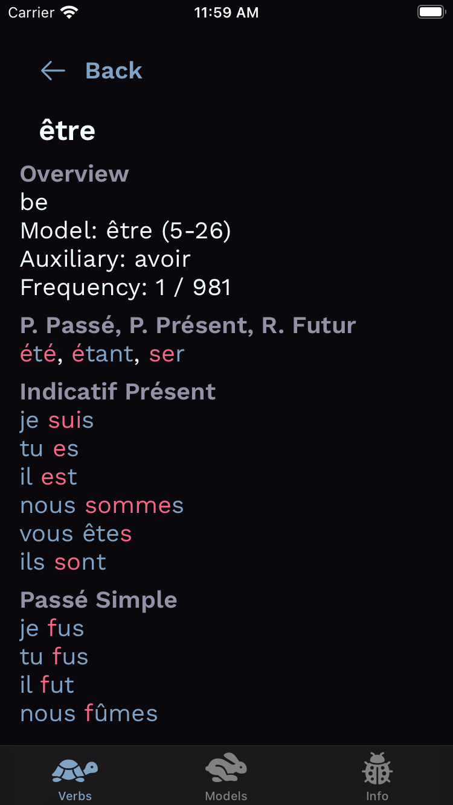
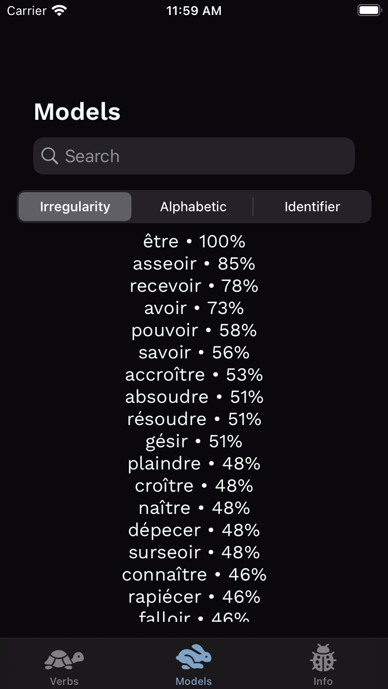
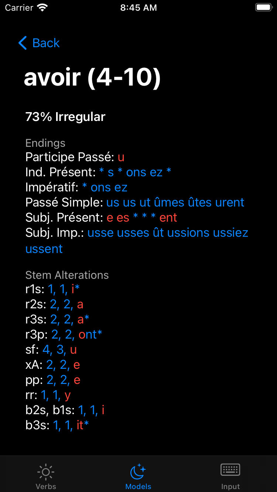
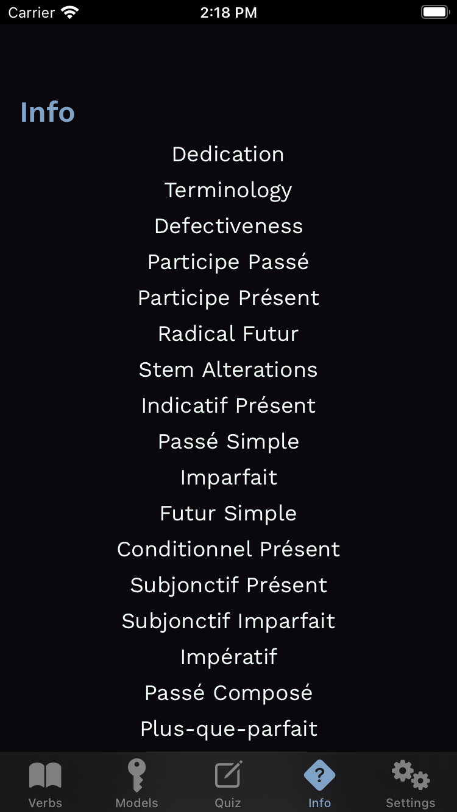
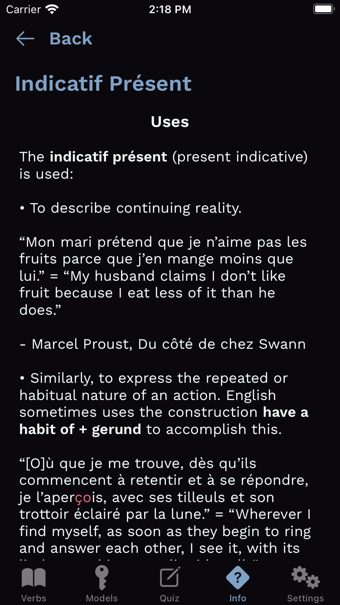

Conjuguer
=========

**Conjuguer** is an iOS™ app for learning French verb conjugations. **Conjuguer** conjugates 6,320 verbs, regular and irregular, in _all_ French verb tenses.


**Conjuguer** is available for free download in the iOS App Store™. Tap the button below to install.

[](https://apps.apple.com/us/app/conjuguer/id1588624373)

Alternatively, you can clone this repo and build **Conjuguer** yourself.

While developing **Conjuguer**, I learned about SwiftUI and how to mix it with UIKit.

### Version 2.0 Features

In addition to browsing verbs, verb models, and tense descriptions, **Conjuguer** 2.0 adds:

- A **conjugation quiz** with two difficulty levels, scoring, a Live Activity, and Game Center leaderboards.
- A **retro arcade minigame** unlocked from the quiz.
- An **AI tutor** (on-device, powered by Apple's Foundation Models) that answers French-conjugation questions.
- **Home Screen and Lock Screen widgets** plus a Control Center control: a "Verb of the Day" and a tappable daily quiz.
- **English and French** localization throughout.

### Building from Source

**Conjuguer** reads its analytics (TelemetryDeck) app ID from a gitignored `Conjuguer/Secrets.xcconfig`
that is not checked in. Before your first build, create it from the template:

```bash
cp Conjuguer/Secrets.example.xcconfig Conjuguer/Secrets.xcconfig
```

Then fill in your own `TELEMETRY_DECK_APP_ID` (or leave the placeholder — the app builds and runs
either way; analytics simply go nowhere). Open `Conjuguer.xcodeproj` in Xcode and build the
`Conjuguer` scheme.

### Screenshots

_(These screenshots predate the 2.0 release and show the verb, model, and tense-description browsers; the quiz, minigame, tutor, and widgets are not pictured.)_

| Verb List | Verb |
| --- | --- |
|  |  |

| Verb-Model List | Verb Model |
| --- | --- |
|  |  |

| Tense-Description List | Tense Description |
| --- | --- |
|  |  |

### License

**Conjuguer** is licensed under the GNU General Public License in order to discourage release of low-quality clones to the App Store™. Conjugar briefly suffered this indignity.
