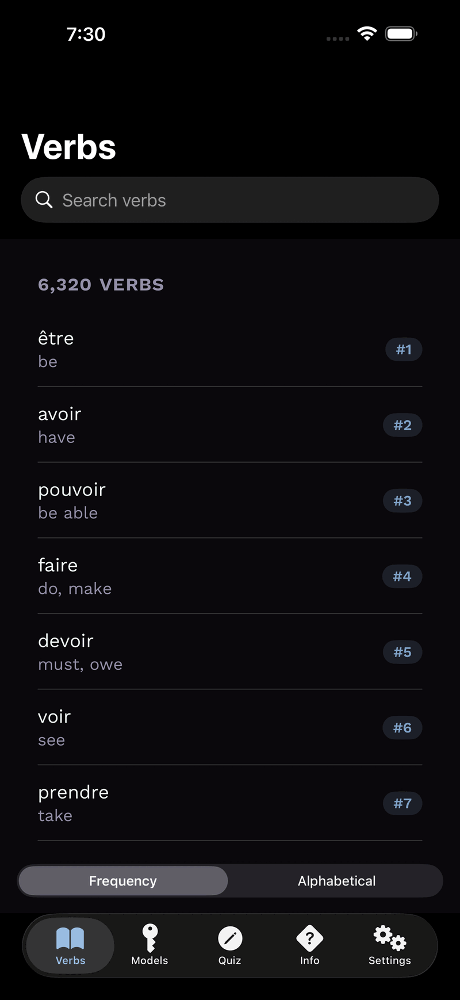
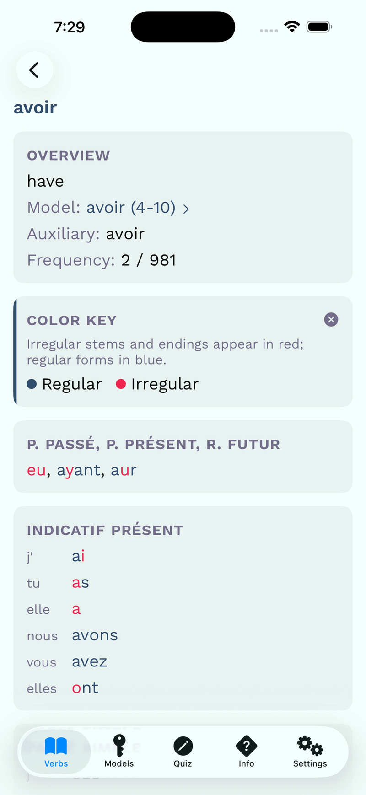
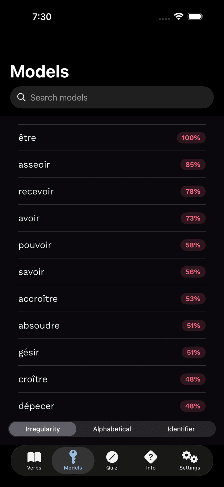
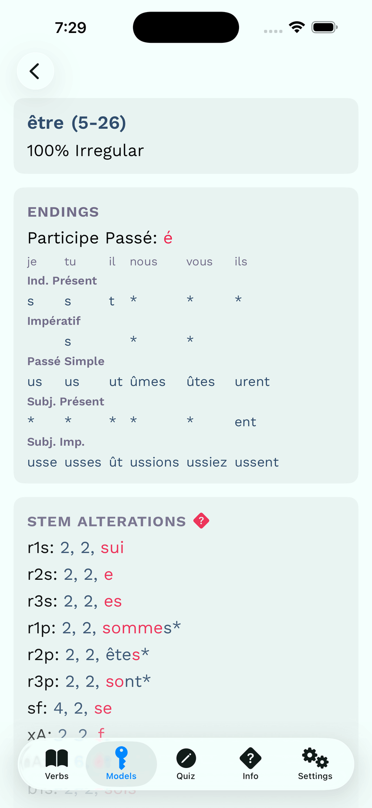
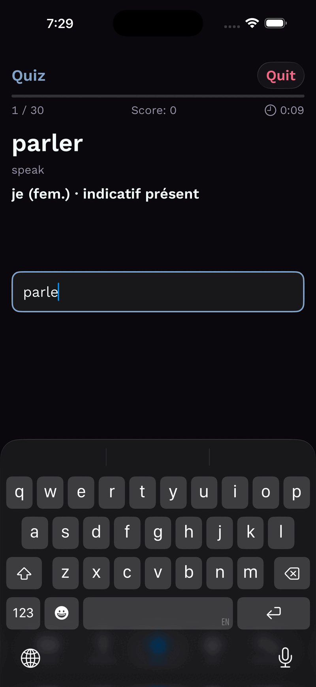
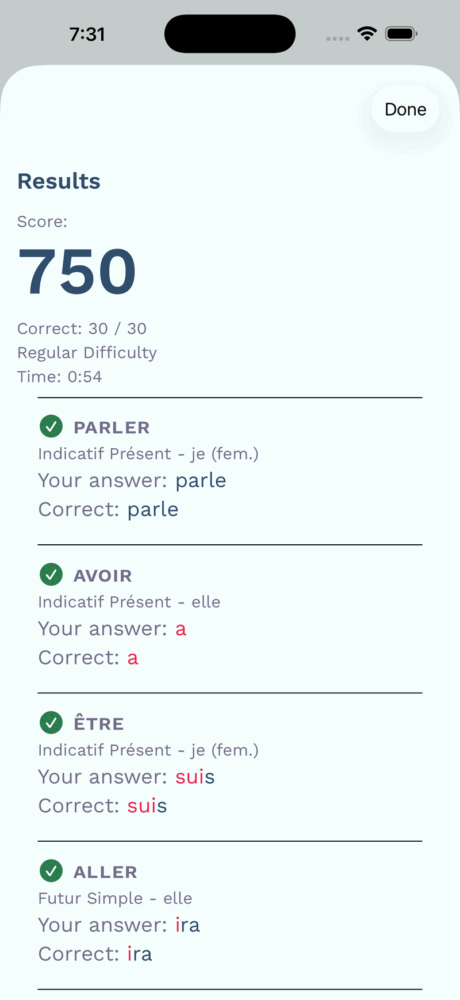
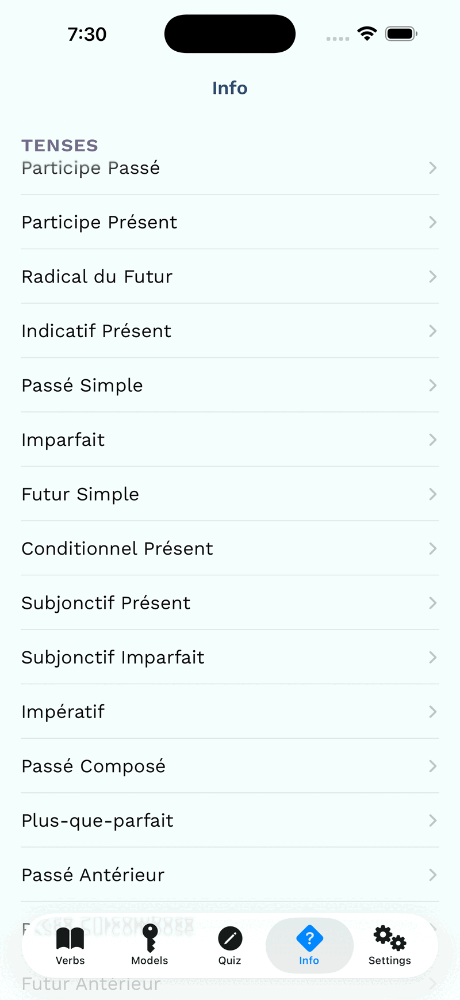
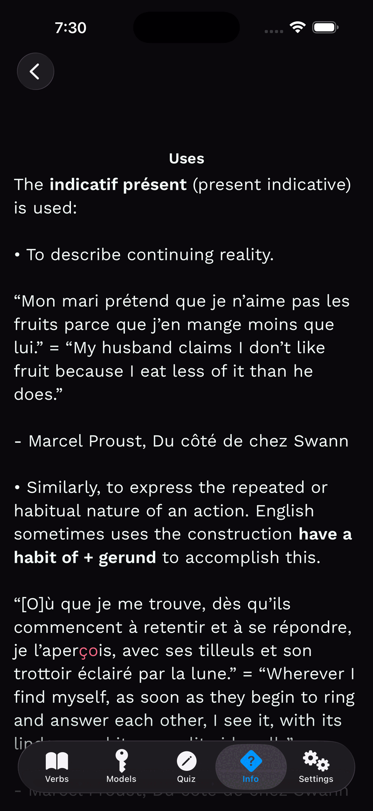
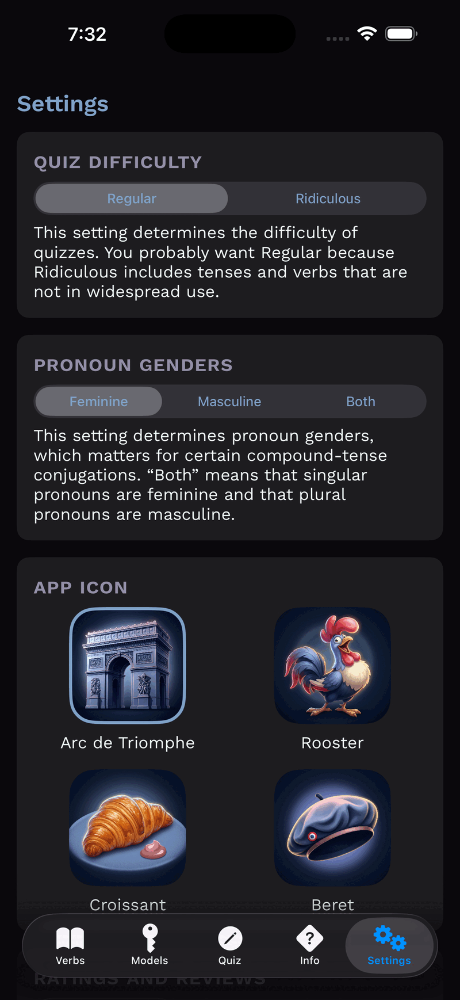
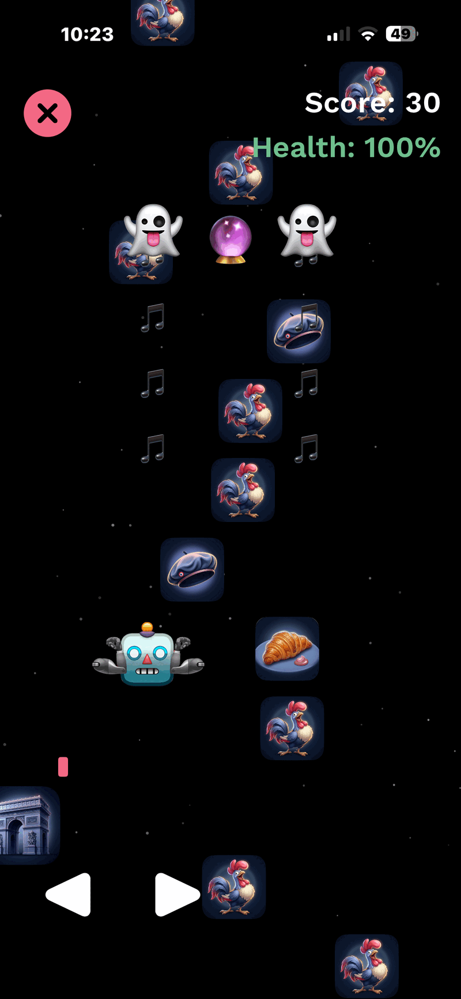

Conjuguer
=========

**Conjuguer** is an iOS™ app for learning French verb conjugations. **Conjuguer** conjugates 6,330 verbs, regular and irregular, in _all_ French verb tenses.

**Conjuguer** is available for free download in the iOS App Store™. Tap the button below to install.

[](https://apps.apple.com/us/app/conjuguer/id1588624373)

Alternatively, you can clone this repo and build **Conjuguer** yourself.

While developing **Conjuguer** in 2021, I learned about SwiftUI and how to mix it with UIKit. The app is now SwiftUI throughout, apart from a small UIKit shim that hosts Game Center's authentication UI.

### Features

- **Verb browser** — all 6,330 verbs, searchable and sortable by frequency of use or alphabetically, in a list or a grid. Every verb carries a frequency rank, not just the common ones.
- **Conjugation views** — every tense for a given verb, with irregular stems and endings picked out in red so that the shape of an irregularity is visible at a glance. Many verbs also carry an etymology and an example sentence drawn from French literature.
- **Verb models** — the conjugation patterns that the verbs inherit from, ranked by how irregular they are.
- **Tense reference** — an explanation of each French tense, when to use it, and how it is formed, illustrated with quotations from Proust, the _Chanson de Roland_, and others.
- **Conjugation quiz** — two difficulty levels, scoring that gives partial credit for a correct skeleton with a dropped accent, a Live Activity, and Game Center leaderboards.
- **AI tutor** — answers French-conjugation questions on-device, powered by Apple's Foundation Models. Requires Apple Intelligence.
- **Widgets and controls** — a "Verb of the Day" and a tappable daily quiz on the Home Screen and Lock Screen, plus two Control Center controls.
- **Retro arcade minigame**, reachable from Settings.
- **Alternate app icons** — Arc de Triomphe, rooster, croissant, or beret.
- **English and French** localization throughout, with VoiceOver labels that switch pronunciation between the two languages so that French forms are not read aloud as English.

### Screenshots

| Verb List | Verb | Verb-Model List | Verb Model | Quiz |
| --- | --- | --- | --- | --- |
|  |  |  |  |  |

| Quiz Results | Tense List | Tense Description | Settings | Minigame |
| --- | --- | --- | --- | --- |
|  |  |  |  |  |

### Building from Source

**Conjuguer** targets iOS 26 and builds with Swift 6. Open `Conjuguer.xcodeproj` in Xcode and build the
`Conjuguer` scheme.

Before your first build, create the gitignored `Conjuguer/Secrets.xcconfig` from its template. It holds
the analytics (TelemetryDeck) app ID, which is not checked in:

```bash
cp Conjuguer/Secrets.example.xcconfig Conjuguer/Secrets.xcconfig
```

Then fill in your own `TELEMETRY_DECK_APP_ID` (or leave the placeholder — the app builds and runs
either way; analytics simply go nowhere).

To run SwiftLint on each commit, enable the repo's pre-commit hook once per clone:

```bash
git config core.hooksPath .githooks
```

Further documentation lives in [`docs/`](docs), starting with the annotated directory tree in
[`docs/project-structure.md`](docs/project-structure.md).

### Verb frequency

Conjuguer ranks every verb by frequency of use. The counts behind those ranks are derived
from **GLÀFF 1.2.2** (Sajous, Hathout & Calderone; CLLE-ERSS, Université de Toulouse), a
lexicon built from Wiktionnaire and released under the [Creative Commons
Attribution-ShareAlike 3.0](http://creativecommons.org/licenses/by-sa/3.0/) licence, with
tie-breaks and a handful of compound-verb estimates from **Lexique 4.00** (New, Pallier,
Schalchli, Bourgin & Gimenes, 2026), released under CC BY-SA 4.0. From 2021 to 2026 the
rankings came from Lexical Computing's Sketch Engine, which covered the 981 most common
verbs.

> Franck Sajous, Nabil Hathout et Basilio Calderone (2013). *GLÀFF, un Gros Lexique À tout
> Faire du Français.* Actes de la 20e conférence sur le Traitement Automatique des Langues
> Naturelles (TALN 2013), Les Sables d'Olonne, France, pp. 285–298.
>
> Boris New, Christophe Pallier, Gauvain Schalchli, Jessica Bourgin & Manuel Gimenes (2026).
> *Lexique 4.* Behavior Research Methods.

The count attributes in [`Conjuguer/Models/verbs.xml`](Conjuguer/Models/verbs.xml) are
derived data under CC BY-SA 3.0 — the app's own code is GPL, and the data file carries its
own notice. The pipeline that produced them, its provenance, and its re-download recipe are
in [`frequency/README.md`](frequency/README.md); the resulting order is
[`docs/frequencies.txt`](docs/frequencies.txt).

### License

**Conjuguer** is licensed under the GNU General Public License in order to discourage release of low-quality clones to the App Store™. Conjugar briefly suffered this indignity.
