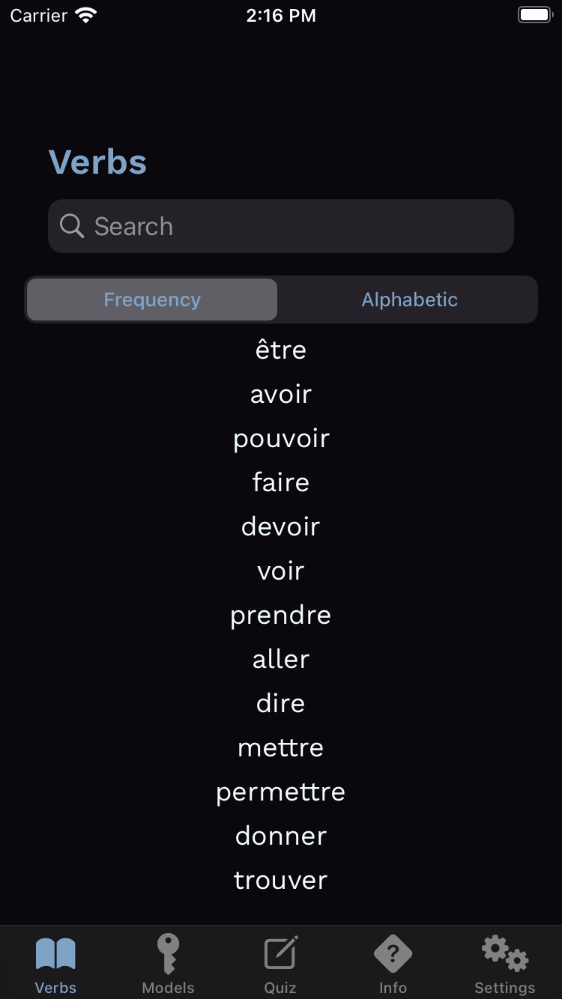
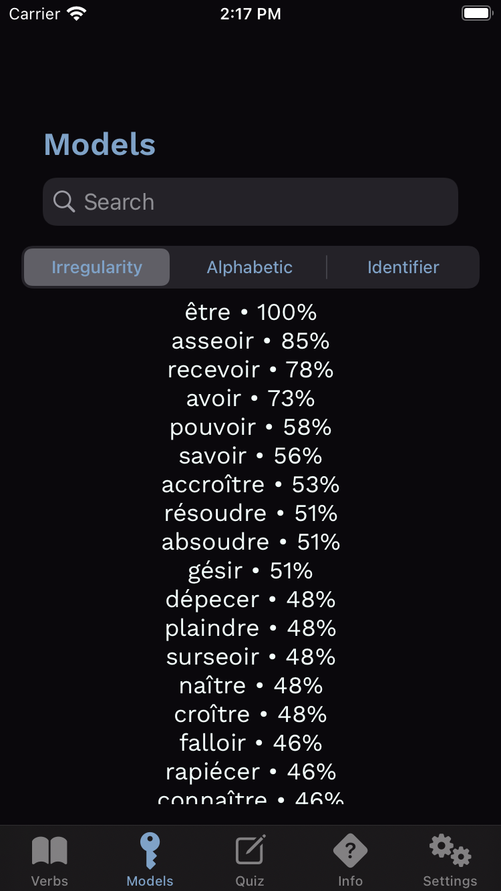

Conjuguer
=========

**Conjuguer** is an iOS™ app for learning French verb conjugations. **Conjuguer** conjugates 6,314 verbs, regular and irregular, in _all_ French verb tenses.

**Conjuguer** shares features with its Spanish-verb predecessor, [Conjugar](https://itunes.apple.com/us/app/conjugar/id1236500467?mt=8), but **Conjuguer** represents conjugation irregularities in a more parsimonious manner, allowing **Conjuguer** to conjugate more verbs.

Unlike Conjugar, **Conjuguer** contains verb frequency-of-use data, which allows learners to focus their studies on the most important verbs.

**Conjuguer** is available for free download in the iOS App Store™. Tap the button below to install.

Alternatively, you can clone this repo and build **Conjuguer** yourself.

While developing **Conjuguer**, I learned about SwiftUI and how to mix it with UIKit.

### Screenshots

| Verb List | Verb |
| --- | --- |
|  |  |

| Verb-Model List | Verb Model |
| --- | --- |
|  |  |

| Tense-Description List | Tense Description |
| --- | --- |
|  |  |

### License

**Conjuguer** is licensed under the GNU General Public License in order to discourage release of low-quality clones to the App Store™. Conjugar briefly suffered this indignity.
