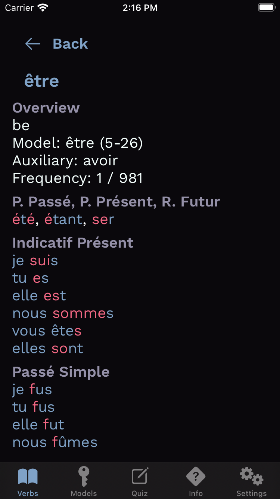
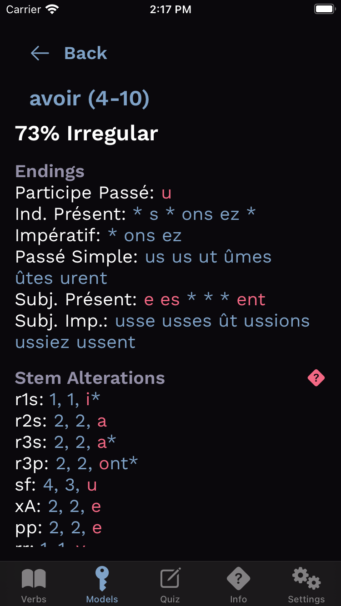

**Conjuguer** is a nascent iOS™ app for learning French verb conjugations. **Conjuguer** conjugates 6,310 verbs, regular and irregular, in _all_ French verb tenses.

**Conjuguer** shares and will share features with its Spanish-verb predecessor, [Conjugar](https://itunes.apple.com/us/app/conjugar/id1236500467?mt=8), but **Conjuguer** represents conjugation irregularities in a more parsimonious manner, allowing **Conjuguer** to conjugate more verbs.

Unlike Conjugar, **Conjuguer** contains verb frequency-of-use data, which allows learners to focus their studies on the most important verbs.

### Screenshots

| Verb List | Verb |
| --- | --- |
|  |  |

| Verb-Model List | Verb Model |
| --- | --- |
|  |  |

### License

**Conjuguer** is licensed under the GNU General Public License in order to discourage release of low-quality clones to the App Store™. Conjugar briefly suffered this indignity.

The image in the placeholder app icon and splash-screen are by Anirudh Koul, who released the image under the [CC BY-NC 2.0](https://creativecommons.org/licenses/by-nc/2.0/).

### TODOs

* Add quiz mode and integrate with Game Center™.
* Add more descriptions of tenses.
* Add a help button to explain endings and stem alterations on the verb-model screen.
* Add unit tests for non-SwiftUI code. There _are_ unit tests for all eighty-five verb models and for all compound tenses.
* Ensure that the app takes full advantage of accessibility APIs and features.
* Hire a designer to create an app icon and other icons.
* Create a Vapor-based analytics backend and instrument the client.
* Put iOS-specific, SwiftUI, and verb-conjugation code in separate frameworks to facilitate a Mac port.
* Allow users to specify pronoun genders.
* I salute you for reading this far.

